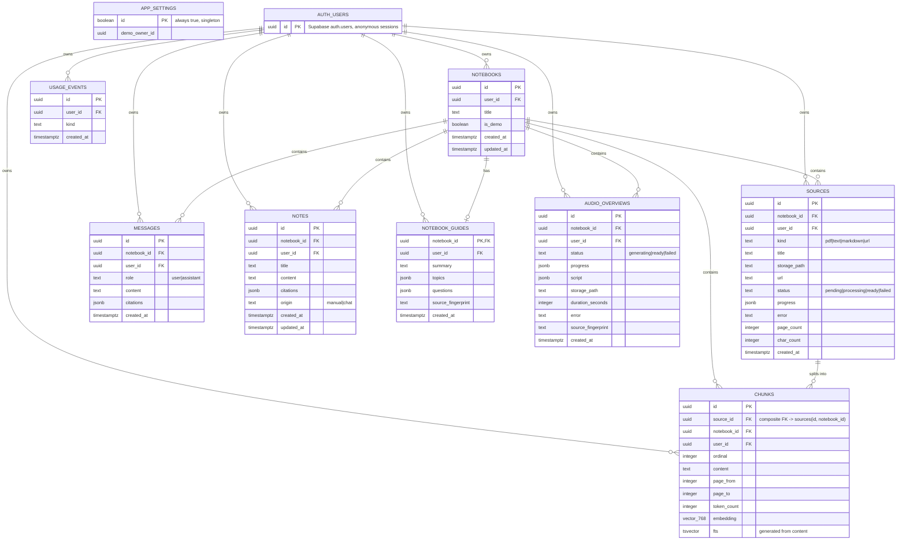

# Data model

Source of truth: `supabase/migrations/20260925161242_schema_and_rls.sql` (T02, branch `feat/t02-schema-and-rls`). RLS policies are summarized here; read the migration for the exact `using`/`with check` expressions.

## Entity diagram

`APP_SETTINGS` and `AUTH_USERS` are referenced by `demo_owner_id` / every `user_id`, drawn without edges to those two to keep the diagram legible — see "Demo notebook" below.

## Tables

| Table | Key columns | Notes |
|---|---|---|
| `app_settings` | `id boolean PK` (always `true`), `demo_owner_id uuid` | Single row. Readable by all authenticated users, writable by none through the API — service role only. |
| `notebooks` | `id`, `user_id`, `title` (≤200 chars), `is_demo` | Root of ownership; every other table's RLS chains back to this via `notebook_id`. |
| `sources` | `id`, `notebook_id`, `user_id`, `kind`, `title`, `storage_path`, `url`, `status`, `progress jsonb`, `updated_at` | `unique (id, notebook_id)` exists so `chunks` can carry a composite FK. `updated_at` trigger, same as `notebooks`. |
| `chunks` | `id`, `source_id`, `notebook_id`, `user_id`, `ordinal`, `content`, `embedding vector(768)`, `fts tsvector` | FK is `(source_id, notebook_id) → sources(id, notebook_id)`, not a plain `source_id → sources(id)` — this is what stops a chunk from being attached to a source in a different notebook. HNSW index on `embedding`, GIN on `fts`. Read-only through the API — see "RLS pattern". |
| `messages` | `id`, `notebook_id`, `user_id`, `role`, `content`, `citations jsonb` | No demo select policy: everyone chats with the demo notebook, but each visitor only ever reads their own messages. |
| `notes` | `id`, `notebook_id`, `user_id`, `title`, `content`, `citations jsonb`, `origin` | `updated_at` trigger, same as `notebooks`. |
| `notebook_guides` | `notebook_id PK/FK`, `user_id`, `summary`, `topics jsonb`, `questions jsonb`, `source_fingerprint` | One row per notebook — `notebook_id` is the primary key, not a separate `id`. |
| `audio_overviews` | `id`, `notebook_id`, `user_id`, `status`, `script jsonb`, `storage_path`, `duration_seconds` | No client insert/update policy — written by the server under the service role only; clients read and delete. |
| `usage_events` | `id`, `user_id`, `kind`, `created_at` | Append-only, for rate limiting. No client insert policy — a client-writable one would let a user erase or fabricate their own usage. |
| `user_activity` | `user_id PK/FK`, `last_seen_at` | One row per user, written only by the security-definer `touch_last_seen()`. No policies and no grants: the row *is* the claim "this user has been seen", so a client that could write it could keep itself from ever being deleted. |
| `retention_state` | `user_id PK/FK`, `attempted_at` | One row per user, the last time the cleanup claimed them. Bookkeeping, not activity — separate from `user_activity` so recording an attempt never makes an idle user look active. No policies and, unusually, no grants at all: only `claim_retention_user()` and `list_retention_candidates()` read it, both security definer. |

## Demo notebook

The demo notebook and everything under it belongs to a dedicated auth user, whose id is the single row in `app_settings.demo_owner_id`. Any table with a demo-select policy checks **both**:

1. the row's parent `notebooks.is_demo = true`, and
2. the row's own `user_id = app_settings.demo_owner_id`.

Checking only (1) would let a visitor read a row they put into the demo notebook (their own row, `is_demo` true by virtue of the parent) as if it were the demo owner's — a stored prompt-injection path into every reviewer's session. `notebooks`, `sources`, `chunks`, `notebook_guides` and `audio_overviews` all carry this pair of checks; `messages` and `notes` don't need it (`messages` has no demo-select policy at all, `notes` has no demo content). For `chunks` the check is now defense in depth rather than the only barrier: with no write grant, no visitor can put a row there in the first place.

## Storage buckets

| Bucket | Public | Size cap | MIME types | Layout |
|---|---|---|---|---|
| `sources` | no | 15 MiB | `application/pdf` | `{auth.uid()}/…` (owner read/write/delete), `demo/…` (read-only to all authenticated users) |
| `audio` | no | 50 MiB | `audio/mpeg`, `audio/wav` | `{auth.uid()}/…` (owner read/delete; write is server-only), `demo/…` (read-only) |

## RLS pattern

Every table: `alter table … enable row level security`, `to authenticated` on every policy (so demo-select policies aren't reachable by unauthenticated requests using only the anon key), owner policies scoped by `user_id = (select auth.uid())`. Insert/update `with check` on `sources`, `notes`, `notebook_guides` also verifies the parent notebook is owned by the same user and is not the demo notebook — see `conventions/database.md` and `conventions/security.md` §3.

`chunks` carries no insert, update or delete policy and no write grant (20260929102647): clients read them, the ingest pipeline writes them under the service role. Only `chunks_select_owner` and `chunks_select_demo` remain. Deleting a source or notebook still clears its chunks — the foreign-key cascade runs as the table owner, so it needs no client privilege.
